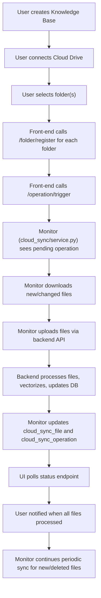

# OpenWebUI Cloud Sync: System, Code, and Database Overview

---

## Feature Summary

Cloud Sync enables OpenWebUI knowledge bases to automatically and continuously synchronize files from connected cloud storage providers (currently Google Drive). The system supports:
- Initial and ongoing background sync of files and folders
- Automatic vectorization and knowledge base updates
- Robust tracking of sync status, operations, and conflicts
- Scalable, production-ready operation via Docker Compose or other process managers

---

## System Flowchart



---

## Files Added

**Backend:**
- `backend/cloud_sync/monitor.py` — Main sync orchestration logic
- `backend/cloud_sync/service.py` — Entrypoint for running the monitor as a background process
- `backend/cloud_sync/providers/google_drive.py` — Google Drive API integration
- `backend/cloud_sync/config.py` — Centralized configuration management
- `backend/cloud_sync/logs/monitor.log` — Persistent, rotating log file (auto-created)
- (Optionally) migration scripts for new tables

**Frontend:**
- No new files required for core sync; only minor changes to call new endpoints and poll status

---

## Files Updated

**Backend:**
- `backend/open_webui/routers/cloud_sync.py`
  - Added endpoints:
    - `POST /api/cloud-sync/knowledge/{kb_id}/folder/register`
    - `POST /api/cloud-sync/operation/trigger`
    - (Plus request models and logic for these endpoints)
- `backend/open_webui/models/cloud_sync.py`
  - (If not present, added models for new tables)
- `backend/open_webui/models/knowledge.py`
  - (If not present, updated for folder metadata)
- `backend/cloud_sync/monitor.py`
  - Added RotatingFileHandler for persistent logs

**Database:**
- Migration scripts to create the new tables (see below)

---

## Database Schema & Migration

### Tables Added

#### 1. `cloud_sync_file`
Tracks every file known to the sync system, its status, and metadata.

#### 2. `cloud_sync_operation`
Tracks sync operations (initial sync, manual re-sync, etc.) and their status.

#### 3. `cloud_sync_conflict`
Tracks file conflicts (e.g., same name, different content).

**Schema and Indexes:**

```sql
-- cloud_sync_file
CREATE TABLE IF NOT EXISTS cloud_sync_file (
    id TEXT PRIMARY KEY,
    knowledge_id TEXT,
    user_id TEXT,
    provider TEXT,
    cloud_file_id TEXT,
    cloud_folder_id TEXT,
    cloud_folder_name TEXT,
    filename TEXT,
    mime_type TEXT,
    file_size INTEGER,
    cloud_modified_time INTEGER,
    cloud_checksum TEXT,
    sync_status TEXT,
    last_sync_time INTEGER,
    created_at INTEGER,
    updated_at INTEGER,
    meta JSON
);

CREATE INDEX IF NOT EXISTS idx_cloud_sync_file_knowledge_id ON cloud_sync_file(knowledge_id);
CREATE INDEX IF NOT EXISTS idx_cloud_sync_file_cloud_file_id ON cloud_sync_file(cloud_file_id);
CREATE INDEX IF NOT EXISTS idx_cloud_sync_file_status ON cloud_sync_file(sync_status);

-- cloud_sync_operation
CREATE TABLE IF NOT EXISTS cloud_sync_operation (
    id TEXT PRIMARY KEY,
    knowledge_id TEXT,
    user_id TEXT,
    provider TEXT,
    operation_type TEXT,
    status TEXT,
    started_at INTEGER,
    finished_at INTEGER,
    stats_json JSON,
    created_at INTEGER,
    updated_at INTEGER
);

CREATE INDEX IF NOT EXISTS idx_cloud_sync_operation_knowledge_id ON cloud_sync_operation(knowledge_id);
CREATE INDEX IF NOT EXISTS idx_cloud_sync_operation_status ON cloud_sync_operation(status);

-- cloud_sync_conflict
CREATE TABLE IF NOT EXISTS cloud_sync_conflict (
    id TEXT PRIMARY KEY,
    knowledge_id TEXT,
    user_id TEXT,
    provider TEXT,
    cloud_file_id TEXT,
    conflict_type TEXT,
    status TEXT,
    created_at INTEGER,
    updated_at INTEGER,
    meta JSON
);

CREATE INDEX IF NOT EXISTS idx_cloud_sync_conflict_knowledge_id ON cloud_sync_conflict(knowledge_id);
CREATE INDEX IF NOT EXISTS idx_cloud_sync_conflict_status ON cloud_sync_conflict(status);
```

---

## API Endpoints Added

- `POST /api/cloud-sync/knowledge/{kb_id}/folder/register`  
  Registers a folder for sync (no processing yet).

- `POST /api/cloud-sync/operation/trigger`  
  Triggers a sync operation (initial or manual).

- `GET /api/cloud-sync/stats/{knowledge_id}`  
  Returns sync statistics for a knowledge base.

- `GET /api/cloud-sync/files?knowledge_id=...`  
  Lists all tracked files for a knowledge base.

- `GET /api/cloud-sync/operations?knowledge_id=...`  
  Lists recent sync operations for a knowledge base.

---

## System Step-by-Step

1. **User creates a Knowledge Base (KB).**
2. **User connects a cloud provider (e.g., Google Drive) and authenticates.**
3. **User selects one or more folders to sync.**
4. **Front-end calls `/folder/register` for each folder.**
5. **Front-end calls `/operation/trigger` to insert a pending sync operation.**
6. **Monitor (`cloud_sync/service.py`) sees the pending operation and processes the initial sync:**
   - Downloads new/changed files from the provider
   - Uploads and vectorizes them via the backend API
   - Updates `cloud_sync_file` and `cloud_sync_operation` tables
   - Removes deleted files and cleans up vectors
   - Handles conflicts and errors robustly
7. **UI polls for sync status and notifies the user when all files are processed.**
8. **Monitor continues periodic sync for new/deleted files at the configured interval.**
9. **All activity is logged to persistent, rotating log files for audit and debugging.**

---

## Logging

- All monitor activity is logged to `backend/cloud_sync/logs/monitor.log` (rotating, 5MB x 5 files).
- Logs include sync cycles, file actions, errors, and operation summaries.

---

## Deployment

- **Docker Compose:** Add a `cloud_sync_monitor` service to your `docker-compose.yaml` (see above).
- **Local/dev:** Run `python backend/cloud_sync/service.py` in a terminal.
- **Production:** Use Docker Compose, Kubernetes, or a process manager to ensure the monitor is always running.

---

## Extensibility

- The provider system is pluggable—add new providers (OneDrive, Dropbox, S3) by implementing a new provider module.
- The database schema supports multiple providers, users, and knowledge bases.
- The monitor can be scaled horizontally if needed.

---

## Summary Table of File Changes

| File/Directory                                 | Type      | Purpose/Change                                      |
|------------------------------------------------|-----------|-----------------------------------------------------|
| backend/cloud_sync/monitor.py                  | New       | Main sync orchestration logic                       |
| backend/cloud_sync/service.py                  | New       | Entrypoint for running the monitor                  |
| backend/cloud_sync/providers/google_drive.py   | New       | Google Drive API integration                        |
| backend/cloud_sync/config.py                   | New       | Centralized configuration management                |
| backend/cloud_sync/logs/monitor.log            | New       | Persistent, rotating log file (auto-created)        |
| backend/open_webui/routers/cloud_sync.py       | Updated   | New endpoints for folder register & sync trigger    |
| backend/open_webui/models/cloud_sync.py        | Updated   | Models for new tables                               |
| backend/open_webui/models/knowledge.py         | Updated   | Folder metadata support                             |
| backend/open_webui/migrations/                 | New/Upd   | Migration scripts for new tables                    |

---

## Flowchart (Mermaid)

```mermaid
flowchart TD;
    A[User creates Knowledge Base] --> B[User connects Google Drive]
    B --> C[User selects folder(s)]
    C --> D[Front-end calls /folder/register for each folder]
    D --> E[Front-end calls /operation/trigger]
    E --> F[Monitor (cloud_sync/service.py) sees pending operation]
    F --> G[Monitor downloads new/changed files]
    G --> H[Monitor uploads files via backend API]
    H --> I[Backend processes files, vectorizes, updates DB]
    I --> J[Monitor updates cloud_sync_file and cloud_sync_operation]
    J --> K[UI polls status endpoint]
    K --> L[User notified when all files processed]
    L --> M[Monitor continues periodic sync for new/deleted files]
```

---

**For contributors:**
- See the code in `backend/cloud_sync/`, `open_webui/routers/cloud_sync.py`, and the migration scripts.
- Use the SQL above to create or inspect the sync tables.
- All sync logic is unified in the monitor—no duplicate code paths. 
