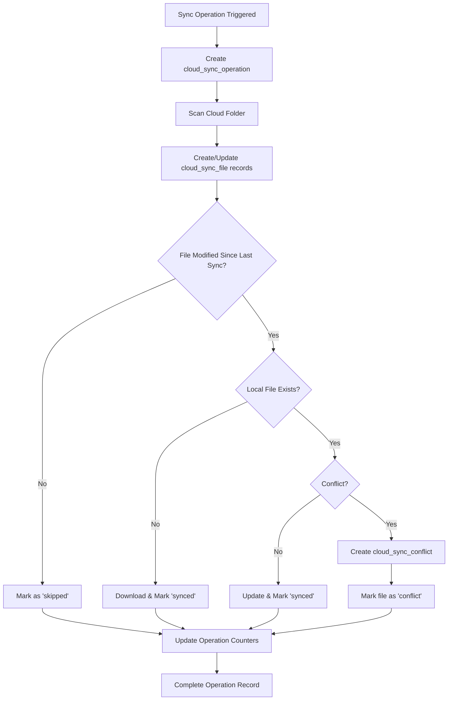

# **📊 Complete Guide: Database Tracking System for Cloud Sync**

## **🗄️ Database Schema Changes**

### **Three New Tables Added:**

## **1. 📋 Database Tables Schema**

---

## **🔄 How the Tracking System Works**

### **Table 1: `cloud_sync_operation` - High-Level Operation Tracking**

**Purpose**: Records every sync operation (manual or auto) from start to finish

**Key Fields**:
- `operation_type`: `'manual'`, `'auto'`, `'initial'`
- `status`: `'running'` → `'completed'`/`'failed'`/`'partial'`
- `files_processed/skipped/failed`: Detailed counters
- `started_at/completed_at/duration_ms`: Performance metrics
- `data`: JSON with errors, operation details, etc.

**Lifecycle**:
```
1. User triggers sync → Create operation record with status='running'
2. During sync → Update counters (files_processed, files_failed)
3. Sync completes → Update status, completed_at, duration_ms
```

---

### **Table 2: `cloud_sync_file` - Individual File Tracking**

**Purpose**: Tracks every file discovered in cloud storage and its sync status

**Key Fields**:
- `cloud_file_id`: Unique ID from cloud provider (Google Drive file ID)
- `file_id`: OpenWebUI file ID (null until synced)
- `sync_status`: `'pending'`, `'synced'`, `'failed'`, `'conflict'`, `'deleted'`
- `*_modified_time`: Timestamps for conflict detection
- `cloud_checksum`: For detecting file changes

**Lifecycle**:
```
1. File discovered in cloud → Create record with status='pending'
2. Download starts → Status remains 'pending'
3. Success → Update status='synced', set file_id
4. Failure → Update status='failed', store error in data
5. Conflict detected → Update status='conflict', create conflict record
```

---

### **Table 3: `cloud_sync_conflict` - Conflict Management**

**Purpose**: Records and manages sync conflicts that need resolution

**Key Fields**:
- `conflict_type`: `'modified_both'`, `'deleted_local'`, `'deleted_cloud'`
- `cloud_state/local_state`: JSON snapshots of file states at conflict time
- `resolution_status`: `'pending'`, `'resolved'`, `'ignored'`
- `resolution_method`: `'cloud-wins'`, `'local-wins'`, `'user-choice'`

---

## **🔗 Data Relationships & Flow**



---

## **📡 API Integration Points**

### **Backend Endpoints** (`/api/cloud-sync/`):

```
POST   /operations              # Create operation record
PUT    /operations/{id}         # Update operation status
GET    /operations              # Get operation history

POST   /files                   # Create/update file record  
PUT    /files/{id}              # Update file status
GET    /files                   # Get file tracking data

GET    /conflicts               # Get pending conflicts
GET    /stats/{knowledge_id}    # Get comprehensive statistics
```

### **Frontend Integration**:

**In `auto-sync.ts`** - Enhanced `checkAndSync()` function:

```typescript
// 1. Create operation record
const operation = await createSyncOperation(userId, knowledgeId, provider, 'manual');

// 2. During sync - file discovery
for (const cloudFile of discoveredFiles) {
  await createOrUpdateSyncFile(userId, knowledgeId, provider, cloudFile);
}

// 3. Update operation with results
await updateSyncOperation(operation.id, {
  status: 'completed',
  files_processed: results.processed,
  files_failed: results.errors.length,
  duration_ms: Date.now() - startTime
});
```

---

## **📊 What Gets Tracked**

### **Every Sync Operation Records**:
- **When**: Exact start/end timestamps
- **Who**: User ID and knowledge base
- **What**: Provider, operation type (manual/auto)
- **Results**: Files processed/skipped/failed counts
- **Performance**: Duration in milliseconds
- **Errors**: Full error details in JSON format

### **Every File Tracks**:
- **Identity**: Cloud file ID, OpenWebUI file ID
- **Metadata**: Filename, size, MIME type, checksums
- **Location**: Cloud folder ID and name
- **Status**: Current sync state
- **History**: Last sync time, modification times
- **Changes**: JSON diff of file metadata changes

### **Every Conflict Records**:
- **Type**: What kind of conflict occurred
- **Context**: Complete state of both versions
- **Resolution**: How it was resolved and by whom
- **Timeline**: When detected and resolved

---

## **🔍 Example Data Queries**

```plaintext
1. User triggers sync → Create operation record with status='running'
2. During sync → Update counters (files_processed, files_failed)
3. Sync completes → Update status, completed_at, duration_ms
```

```plaintext
1. File discovered in cloud → Create record with status='pending'
2. Download starts → Status remains 'pending'
3. Success → Update status='synced', set file_id
4. Failure → Update status='failed', store error in data
5. Conflict detected → Update status='conflict', create conflict record
```

```plaintext
graph TB
    A[Sync Operation Triggered] --> B[Create cloud_sync_operation]
    B --> C[Scan Cloud Folder]
    C --> D[Create/Update cloud_sync_file records]
    D --> E{File Modified Since Last Sync?}
    E -->|No| F[Mark as 'skipped']
    E -->|Yes| G{Local File Exists?}
    G -->|No| H[Download & Mark 'synced']
    G -->|Yes| I{Conflict?}
    I -->|No| J[Update & Mark 'synced']
    I -->|Yes| K[Create cloud_sync_conflict]
    K --> L[Mark file as 'conflict']
    F --> M[Update Operation Counters]
    H --> M
    J --> M  
    L --> M
    M --> N[Complete Operation Record]
```

```plaintext
POST   /operations              # Create operation record
PUT    /operations/{id}         # Update operation status
GET    /operations              # Get operation history

POST   /files                   # Create/update file record  
PUT    /files/{id}              # Update file status
GET    /files                   # Get file tracking data

GET    /conflicts               # Get pending conflicts
GET    /stats/{knowledge_id}    # Get comprehensive statistics
```

```typescript
// 1. Create operation record
const operation = await createSyncOperation(userId, knowledgeId, provider, 'manual');

// 2. During sync - file discovery
for (const cloudFile of discoveredFiles) {
  await createOrUpdateSyncFile(userId, knowledgeId, provider, cloudFile);
}

// 3. Update operation with results
await updateSyncOperation(operation.id, {
  status: 'completed',
  files_processed: results.processed,
  files_failed: results.errors.length,
  duration_ms: Date.now() - startTime
});
```

### **📈 Analytics & Monitoring Examples**:

**1. Performance Analytics**:
```sql
-- Average sync duration by operation type
SELECT operation_type, AVG(duration_ms) as avg_duration_ms
FROM cloud_sync_operation 
WHERE status = 'completed'
GROUP BY operation_type;

-- Success rate over time  
SELECT DATE(created_at, 'unixepoch') as date,
       COUNT(*) as total_ops,
       SUM(CASE WHEN status = 'completed' THEN 1 ELSE 0 END) as successful
FROM cloud_sync_operation
GROUP BY DATE(created_at, 'unixepoch');
```

**2. File Status Overview**:
```sql
-- Files by sync status
SELECT sync_status, COUNT(*) as count
FROM cloud_sync_file
GROUP BY sync_status;

-- Largest files by provider
SELECT provider, filename, file_size
FROM cloud_sync_file
ORDER BY file_size DESC LIMIT 10;
```

**3. Conflict Analysis**:
```sql
-- Pending conflicts by type
SELECT conflict_type, COUNT(*) as count
FROM cloud_sync_conflict
WHERE resolution_status = 'pending'
GROUP BY conflict_type;
```

---

## **⚡ Performance Features**

### **Optimized Indexes**:
- **Operations**: By knowledge_id, user_id, status
- **Files**: By knowledge_id, cloud_file_id, sync_status, provider
- **Conflicts**: By knowledge_id, resolution_status

### **Efficient Queries**:
- Recent operations: `ORDER BY created_at DESC LIMIT 10`
- Failed files: `WHERE sync_status = 'failed'`
- Pending conflicts: `WHERE resolution_status = 'pending'`

### **Data Retention Strategy**:
- Operations: Keep recent 100 per knowledge base
- Files: Keep until file deleted from both cloud and local
- Conflicts: Keep until resolved or 30 days old

---

## **🎯 Real-World Usage Examples**

### **1. User Dashboard**:
```javascript
// Get sync statistics for knowledge base
const stats = await fetch('/api/cloud-sync/stats/kb-123');
// Shows: last sync time, success rate, pending conflicts, file counts
```

### **2. Admin Monitoring**:
```javascript
// Get all failed operations in last 24 hours
const failures = await fetch('/api/cloud-sync/operations?status=failed&since=1703001000');
// Admin can investigate and retry failed operations
```

### **3. Performance Optimization**:
```javascript
// Identify slow sync operations
const slowOps = await fetch('/api/cloud-sync/operations?min_duration=60000');
// Optimize sync logic for large files or many files
```

### **4. Conflict Resolution**:
```javascript
// Get pending conflicts for user review
const conflicts = await fetch('/api/cloud-sync/conflicts?knowledge_id=kb-123');
// Present resolution options to user
```

---

## **🔧 Integration Benefits**

### **For Users**:
- **Transparency**: See exactly what synced and when
- **Reliability**: Track success/failure rates
- **Control**: Manage conflicts manually
- **History**: Complete audit trail

### **For Admins**:
- **Monitoring**: System health and performance
- **Debugging**: Detailed error logs and timing
- **Analytics**: Usage patterns and optimization opportunities
- **Maintenance**: Data cleanup and retention policies

### **For Developers**:
- **Observability**: Full visibility into sync operations
- **Testing**: Verify sync behavior with data
- **Optimization**: Identify bottlenecks and failures
- **Features**: Build advanced sync management UI

---

## **🚀 Current Implementation Status**

✅ **Database Schema**: All tables created with proper indexes  
✅ **Backend APIs**: Full REST API for all operations  
✅ **Frontend Integration**: Auto-sync service enhanced with tracking  
✅ **Testing**: Comprehensive test suite for all features  
✅ **Error Handling**: Graceful degradation when APIs unavailable  

**Ready for production use with enterprise-grade tracking and monitoring!** 🎉

```sql
-- Average sync duration by operation type
SELECT operation_type, AVG(duration_ms) as avg_duration_ms
FROM cloud_sync_operation 
WHERE status = 'completed'
GROUP BY operation_type;

-- Success rate over time  
SELECT DATE(created_at, 'unixepoch') as date,
       COUNT(*) as total_ops,
       SUM(CASE WHEN status = 'completed' THEN 1 ELSE 0 END) as successful
FROM cloud_sync_operation
GROUP BY DATE(created_at, 'unixepoch');
```

```sql
-- Files by sync status
SELECT sync_status, COUNT(*) as count
FROM cloud_sync_file
GROUP BY sync_status;

-- Largest files by provider
SELECT provider, filename, file_size
FROM cloud_sync_file
ORDER BY file_size DESC LIMIT 10;
```

```sql
-- Pending conflicts by type
SELECT conflict_type, COUNT(*) as count
FROM cloud_sync_conflict
WHERE resolution_status = 'pending'
GROUP BY conflict_type;
```

```javascript
// Get sync statistics for knowledge base
const stats = await fetch('/api/cloud-sync/stats/kb-123');
// Shows: last sync time, success rate, pending conflicts, file counts
```

```javascript
// Get all failed operations in last 24 hours
const failures = await fetch('/api/cloud-sync/operations?status=failed&since=1703001000');
// Admin can investigate and retry failed operations
```

```sql
-- Average sync duration by operation type
SELECT operation_type, AVG(duration_ms) as avg_duration_ms
FROM cloud_sync_operation 
WHERE status = 'completed'
GROUP BY operation_type;

-- Success rate over time  
SELECT DATE(created_at, 'unixepoch') as date,
       COUNT(*) as total_ops,
       SUM(CASE WHEN status = 'completed' THEN 1 ELSE 0 END) as successful
FROM cloud_sync_operation
GROUP BY DATE(created_at, 'unixepoch');
```

```sql
-- Files by sync status
SELECT sync_status, COUNT(*) as count
FROM cloud_sync_file
GROUP BY sync_status;

-- Largest files by provider
SELECT provider, filename, file_size
FROM cloud_sync_file
ORDER BY file_size DESC LIMIT 10;
```

```sql
-- Pending conflicts by type
SELECT conflict_type, COUNT(*) as count
FROM cloud_sync_conflict
WHERE resolution_status = 'pending'
GROUP BY conflict_type;
```

```javascript
// Get sync statistics for knowledge base
const stats = await fetch('/api/cloud-sync/stats/kb-123');
// Shows: last sync time, success rate, pending conflicts, file counts
```

```javascript
// Get all failed operations in last 24 hours
const failures = await fetch('/api/cloud-sync/operations?status=failed&since=1703001000');
// Admin can investigate and retry failed operations
```

```javascript
// Identify slow sync operations
const slowOps = await fetch('/api/cloud-sync/operations?min_duration=60000');
// Optimize sync logic for large files or many files
```

```javascript
// Get pending conflicts for user review
const conflicts = await fetch('/api/cloud-sync/conflicts?knowledge_id=kb-123');
// Present resolution options to user
```
